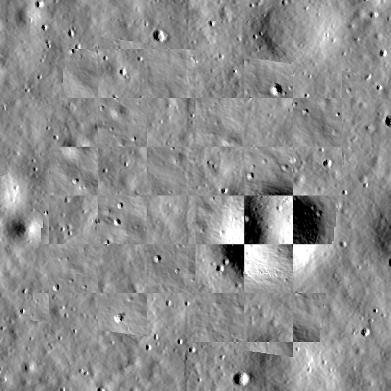
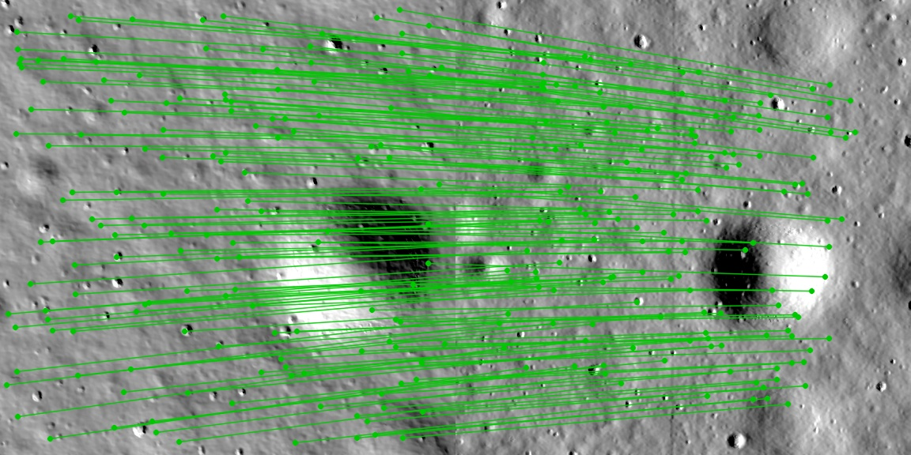
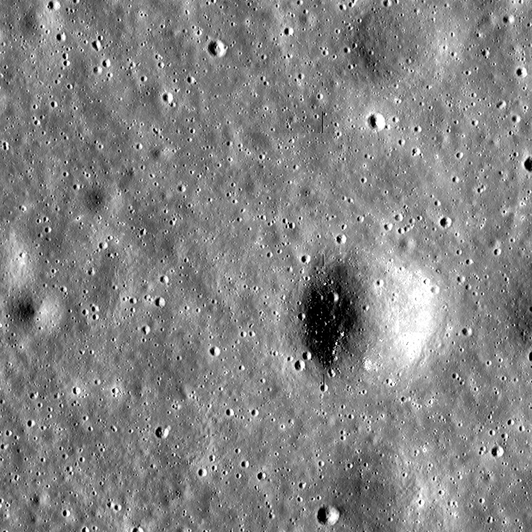
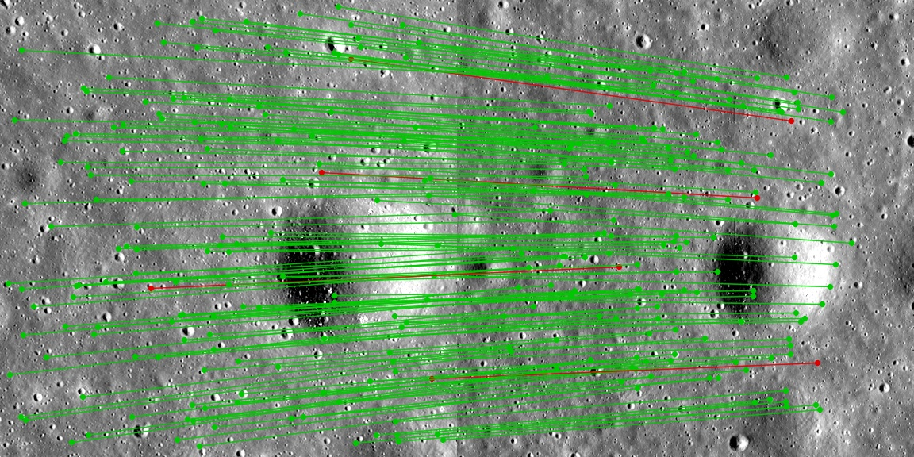
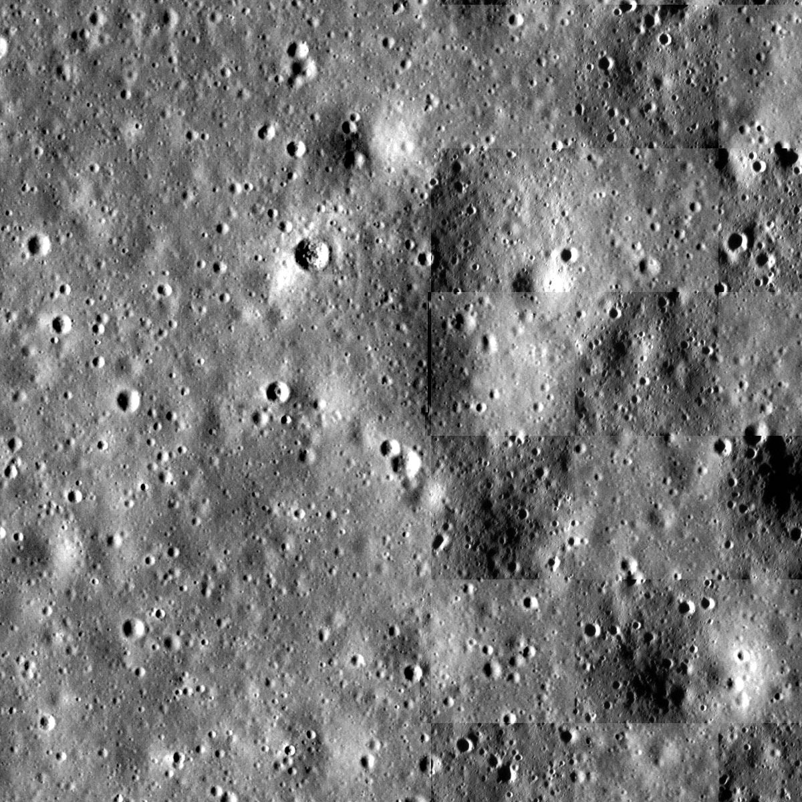
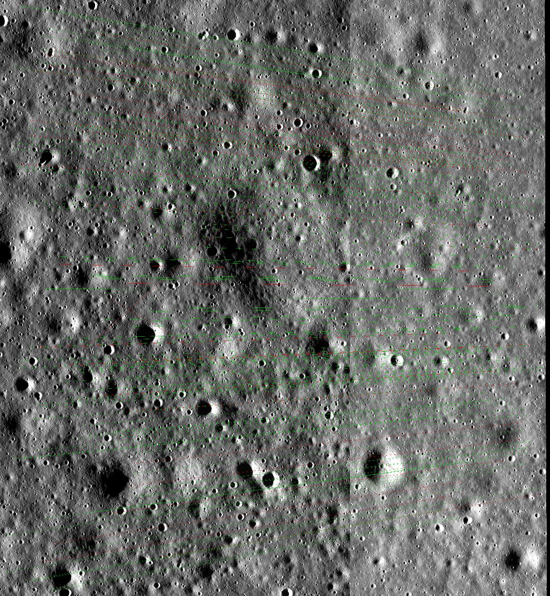
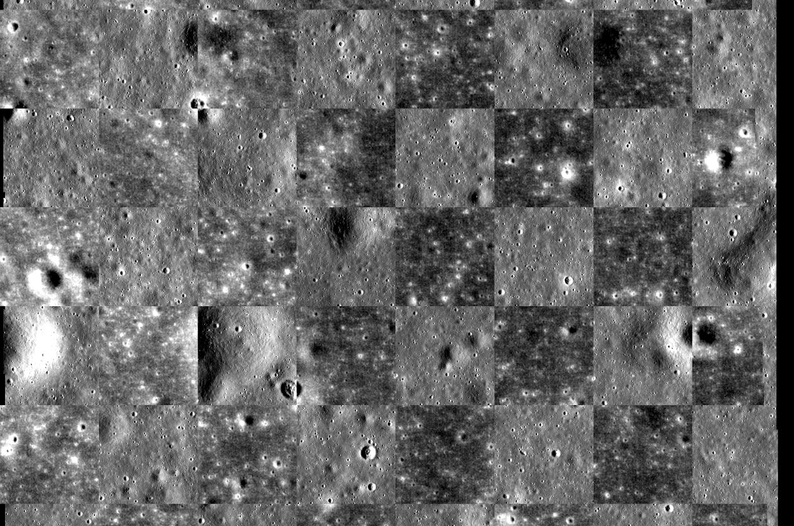
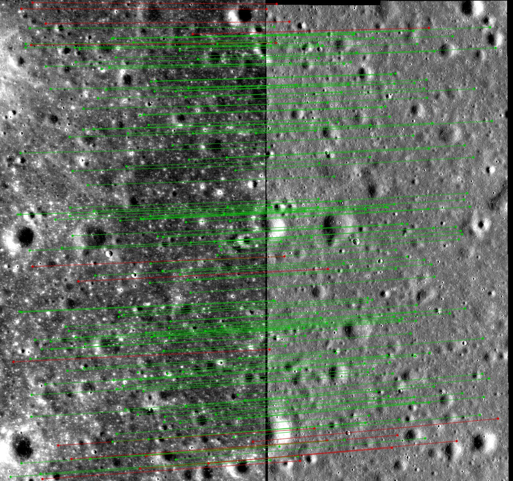

# CHITRA

**Chandrayaan High-precision Image Transformation & Registration Algorithm** — SIH 2026 · PS 26166 · Team Death Eaters

Sun-angle- and scale-invariant registration of Chandrayaan-2 **OHRC / TMC-2 / IIRS** imagery to lunar references (**LRO NAC / WAC, SELENE TC**).
CHITRA renders the reference DEM under the **source's own Sun geometry** (Hapke-family reflectance + cast shadows), so the illumination
difference is removed before matching. It then matches densely with **RoMa v2 (DINOv3)**, fits **MAGSAC++** on **grid-balanced** matches and writes a registered GeoTIFF, the match points,
RMSE / inlier / coverage metrics and a **PASS / FLAG / REJECT verdict**.

Runs on a 16 GB laptop (Apple M4, RoMa v2 on the MPS GPU: ~18 s and ~2 GB RAM per pair) and on a free Colab GPU.

[](https://colab.research.google.com/github/kavyanshops/project-chitra/blob/main/notebooks/chitra_colab.ipynb)

## What the problem statement asks → where CHITRA delivers it

| PS 26166 requirement | CHITRA |
|---|---|
| Illumination variation (Sun azimuth / elevation) | Render-and-Match: DEM shaded at the source Sun (`chitra/render.py`) |
| Scale variation | Both sides resampled to the source GSD before matching; errors reported in **source pixels** |
| Viewpoint variation | Affine (default) or homography fitted with MAGSAC++ (`chitra/geometry.py`) |
| Sub-pixel accuracy of the source image | GT RMSE against known truth, in source px (table below) |
| Uniform distribution of matches | 8×8 grid-balanced sampling + coverage entropy metric |
| Registered product + match points | `registered.tif` (on the reference grid/CRS) + `matches.csv` |
| Evaluation metrics | RMSE, median, P90, inlier count, inlier ratio, coverage entropy → `metrics.json` |

## Results (measured with `uv run chitra benchmark --roma`, Apple M4, ≈6 min)

Apollo 11 site, LROC NAC DTM (2 m/px), three 768×768 px crops (1.5 km). Every source is warped by a **known** similarity (8° rotation +
sub-pixel shift), and optionally downscaled 4×, so the error is measured exactly: **GT RMSE** = RMS error of the estimated transform over a
32×32 grid of source points, in **source pixels**. "Sub-px success" = not rejected **and** GT RMSE < 1 px.

Each cell: sub-pixel successes out of 3 crops · mean GT RMSE of those successes.

| Set | Δ Sun az | Scale | SIFT on raw images | RoMa v2 on raw images | CHITRA · SIFT on render | **CHITRA · RoMa v2 on render** |
|---|---|---|---|---|---|---|
| SYN | 30° | 1× | 1/3 · 0.318 px | 3/3 · 0.100 px | 3/3 · 0.052 px | 3/3 · 0.101 px |
| SYN | 90° | 1× | 0/3 | 0/3 | 3/3 · 0.050 px | 3/3 · 0.125 px |
| SYN | 150° | 1× | 0/3 | 0/3 | 3/3 · 0.048 px | 3/3 · 0.105 px |
| SYN | 30° | 4× | 0/3 | 3/3 · 0.076 px | 3/3 · 0.064 px | 3/3 · 0.076 px |
| SYN | 90° | 4× | 0/3 | 2/3 · 0.821 px | 3/3 · 0.081 px | 3/3 · 0.101 px |
| SYN | 150° | 4× | 0/3 | 0/3 | 3/3 · 0.062 px | 3/3 · 0.109 px |
| REAL-NAC | ≈0° (real) | 1× | 3/3 · 0.108 px | 3/3 · 0.145 px | 3/3 · 0.109 px | 3/3 · 0.145 px |
| REAL-NAC | ≈0° (real) | 4× | 3/3 · 0.096 px | 3/3 · 0.108 px | 3/3 · 0.096 px | 3/3 · 0.108 px |
| NEG (no overlap) | – | 1× | REJECT ✓ | REJECT ✓ | REJECT ✓ | REJECT ✓ |

The full table (inliers, inlier ratio, coverage entropy and the "without grid balancing" ablation) is written to `runs/benchmark.md`.
RoMa rows show 2,560 inliers because grid balancing keeps at most 40 matches per 8×8 cell.

- **SYN**: source = DTM rendered at Sun (270°+Δ, 20°), reference = DTM rendered at (270°, 30°). **Both matchers collapse on raw images once Δaz ≥ 90°**, including the DINOv3-based RoMa v2. With the Sun-matched render, both stay sub-pixel in every case. The physics render is what makes the foundation model work.
- **REAL-NAC**: source = real LROC ortho M150368601, reference = real LROC ortho M150361817 (different orbits, co-registered by LROC), known warp applied.
- **NEG**: two non-overlapping tiles. CHITRA refuses instead of returning a matrix.

**Read these numbers honestly:**
1. In SYN the source is produced by the same renderer CHITRA uses, so the render matches the source photometry exactly. These figures are an **upper bound** for Render-and-Match, not a claim about real Chandrayaan-2 imagery. That is also why SIFT-on-render edges out RoMa-on-render there (0.05 vs 0.10 px). On the real TMC-2 pair, SIFT-on-render is rejected and only RoMa v2 on the render succeeds (next section), so RoMa v2 is the default.
2. The two real LROC orthos have almost the same Sun geometry: our fit gives azimuth ≈270° for both, **estimated** by fitting DTM renders, since the labels carry no Sun angles. REAL-NAC therefore tests real texture, warp and 4× scale, not a large Sun change. There, `auto` mode picks the real reference because the 2 m DTM render lacks albedo and fine texture.
3. Grid balancing did not change GT RMSE here, because matches were already well spread (entropy ≥ 0.9). It exists to guard the uniformity requirement on clustered scenes.
4. Real Chandrayaan-2 runs are in the next section. They have no independent ground truth, so they report fit metrics, not GT RMSE.
5. Literature figures are **reported baselines**, not ours: SIFT IIRS→WAC ≈73 m RMS (preprint); CNSFM 72.3 % polar success; Georgakis 2024 41.8 % at 180° Δaz.

| Δaz 150°: checkerboard of registered source vs reference | Δaz 150°: inlier matches (sample of 150) |
|---|---|
|  |  |
| **Real LROC pair: checkerboard** | **Real LROC pair: matches** |
|  |  |

## Real Chandrayaan-2 results (Apollo 11 site)

Calibrated L1 products from ISSDC PRADAN, registered to the LROC NAC orthophoto M150361817. Each crop is cut and turned north-up
with `scripts/prep_ch2.py`, which reads the PDS4 geometry grid, and then registered with `chitra register`.

| Source → reference | Crop (lines, pixels) | Sun (source → ref) | Verdict | Inliers | Inlier ratio | RMSE (fit) | Coverage entropy |
|---|---|---|---|---|---|---|---|
| **OHRC** `ch2_ohr_ncp_20240330` → NAC 0.5 m | 0–6300, 0–3700 | az 270°, el 7.3° → az ≈270° | **PASS** | 481 | 0.76 | **0.58 px (0.18 m)** | 0.82 |
| **TMC-2** fore `ch2_tmc_ncf_20250207` → NAC 2 m · **RoMa v2 + render (full CHITRA)** | 0–1560, 830–1690 | az 104°, el 44° → az ≈270° (Δaz ≈ 166°) | **PASS** | **2,256** | **0.88** | **0.53 px (2.7 m)** | **0.99** |
| ↳ ablation: RoMa v2 on the raw NAC ortho (no render) | same | same | PASS | 768 | 0.30 | 0.64 px | 0.84 |
| ↳ ablation: SIFT | same | same | REJECT (too_few_inliers) | 9 | – | – | – |

**What these show:**
- **OHRC:** sub-pixel fit on real 0.3 m Chandrayaan-2 imagery. The recovered scale (0.618) matches the geometry-grid GSD ratio 0.307/0.5 = 0.614. RMSE here is transform self-consistency on the inliers; no independent check points exist yet.
- **The OHRC label geolocation is off by 2.16 km** (651 m east, 2,060 m north, constant to ±3 m across the scene). This product's label says `reference_data_used: System` (uncorrected). CHITRA found the true position automatically, with zero manual GCPs.
- **TMC-2 is where Render-and-Match earns its place.** The Sun comes from nearly opposite sides, so crater shading is inverted: correlation with the NAC ortho at the label position is −0.14, while the Sun-matched DTM render correlates +0.24. SIFT is rejected (9 inliers). RoMa v2 against the raw ortho barely passes (inlier ratio 0.30). RoMa v2 against the **render** gives 3× the inliers at ratio 0.88, sub-pixel RMSE and near-uniform coverage. CHITRA picked the render domain automatically. As an independent check, the result agrees with the SELENE-refined label geolocation to **11.6 m on average (≈2 TMC px)**, and the fitted scale matches the grid GSD ratio to 0.1 %.
- **Orientation from the geometry grid:** the TMC-2 fore strip is rotated 180° (pixels run west, lines run north), not mirrored, and its ground GSD is ~5.0 m, not the label's 4.41 m.

| OHRC → NAC: checkerboard (registered OHRC / NAC tiles) | OHRC → NAC: inlier matches |
|---|---|
|  |  |
| **TMC-2 → NAC (opposite Sun): checkerboard** | **TMC-2 → NAC: inlier matches (RoMa v2 on the render)** |
|  |  |

Reproduce (the data paths follow [DATA](docs/DATA.md)):

```bash
uv run python scripts/prep_ch2.py data/raw/ch2/ohrc/ch2_ohr_ncp_20240330T0035085365_d_img_d18 0 6300 0 3700 \
    data/ref/NAC_DTM_APOLLO11_M150361817_50CM.IMG --dem data/ref/NAC_DTM_APOLLO11.TIF --offset 651 2059 --out data/work/ohrc_ncp
uv run chitra register data/work/ohrc_ncp/src.tif data/work/ohrc_ncp/ref.tif --dem data/work/ohrc_ncp/dem.tif \
    --sun-az 269.82 --sun-el 7.27 --src-gsd 0.307 --name ohrc_ncp
```

`--offset` re-centres the reference window after a first run found the 2.16 km label error. That first run, over a window around
the label position, recovered the same offset from the part of the footprint that overlapped. Peak RAM is about 6.5 GB, which fits a 16 GB laptop.

## Run it

```bash
uv sync --extra roma                      # engine + RoMa v2 (drop --extra roma for SIFT only)
uv run python tests/test_pipeline.py      # self-check, no data needed
uv run chitra benchmark [--roma]          # needs data/ref (see docs/DATA.md)

uv run chitra register SRC.tif REF.tif \
    --dem DEM_on_REF_grid.tif --sun-az 120 --sun-el 25 \
    [--src-window COL ROW W H] [--ref-window COL ROW W H] [--model affine|homography] [--out runs]
```

Each run writes `runs/<timestamp>_<name>/`: `config.json`, `metrics.json`, `matches.csv`
(`x_src,y_src,x_ref,y_ref,certainty,inlier,residual_px`), `registered.tif`, `overlay_matches.png`, `overlay_residuals.png`,
`checkerboard.png`, `render.png`. The exit code is 2 on REJECT.

**Matcher.** `--matcher auto` (default) uses RoMa v2 when installed, else SIFT. RoMa v2 runs in its `precise` setting on CUDA and in the
640 px `base` setting on Apple MPS / CPU, which fits a 16 GB laptop.

## Demo

```bash
uv run uvicorn app.main:app --port 8765        # http://localhost:8765 : browse runs, upload a pair, download results
uv run python scripts/export_site.py           # static copy in site/ (same page, no server) for hosting
```

The console shows every run with its verdict and reasons, the metric cards, the match / checkerboard / residual / render views, an 8×8
inlier-density map (the "uniform distribution" requirement), downloads (GeoTIFF, CSV, JSON) and the benchmark table. Uploads are
validated (type, size) and run through the same `register_files` code path as the CLI.

| Doc | Contents |
|---|---|
| [PRD](docs/PRD.md) | Problem, scope, success criteria, claims policy |
| [Architecture](docs/ARCHITECTURE.md) | Pipeline, modules, design decisions |
| [Metrics](docs/METRICS.md) | Metric definitions, verdict policy, evaluation sets, ablations |
| [Data](docs/DATA.md) | Reference + Chandrayaan-2 data acquisition |
| [Roadmap](docs/ROADMAP.md) | Post-prototype research plan, known limitations |

Data: LROC/PDS (public domain); Chandrayaan-2 data © ISRO/ISSDC, used under ISRO's data-use policy.
